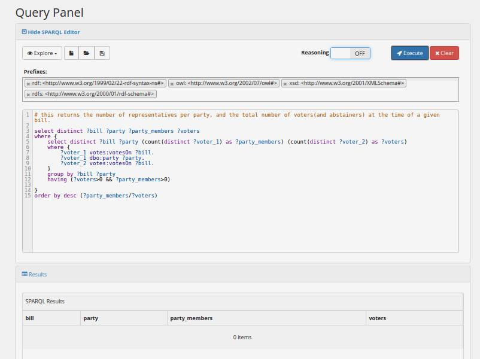
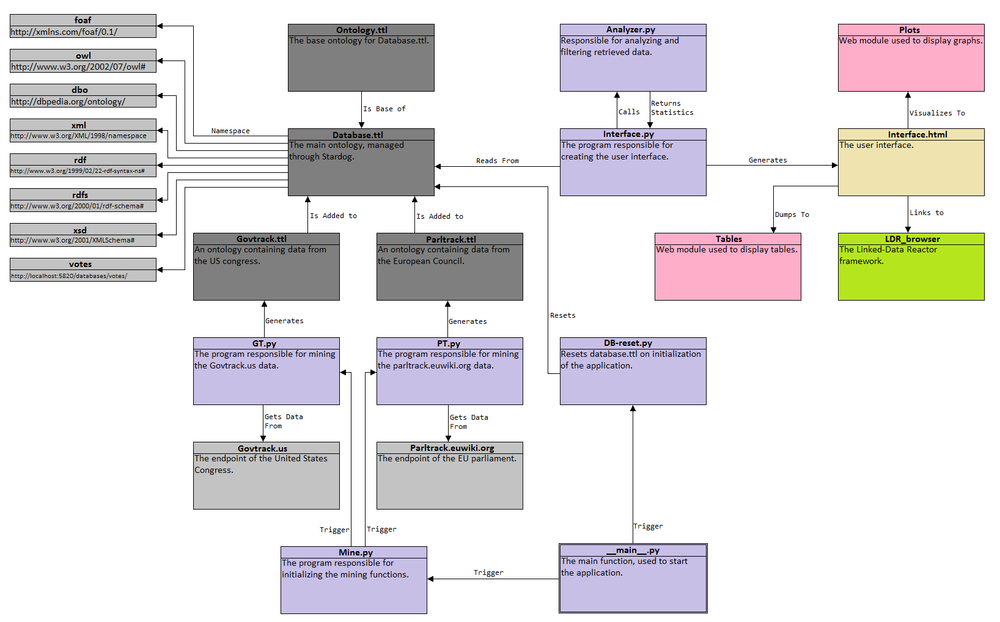
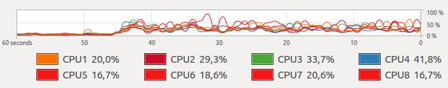

<!-- START doctoc generated TOC please keep comment here to allow auto update -->
<!-- DON'T EDIT THIS SECTION, INSTEAD RE-RUN doctoc TO UPDATE -->
**Table of Contents** 

- [Final Report](#final-report)
  - [Abstract](#abstract)
  - [Introduction](#introduction)
  - [Goals](#goals)
    - [Primary Goals](#primary-goals)
    - [Secondary Goals](#secondary-goals)
  - [Application](#application)
    - [Description](#description)
      - [Open Endpoint](#open-endpoint)
      - [Technical Requirements](#technical-requirements)
  - [Users](#users)
    - [Satistfaction Requirements](#satistfaction-requirements)
    - [Target groups by Satistfaction Requirements](#target-groups-by-satistfaction-requirements)
      - [Target group 1: People with domain interest](#target-group-1-people-with-domain-interest)
      - [Target group 2: Developers](#target-group-2-developers)
      - [Target group 3: People who are attracted to data visualizations](#target-group-3-people-who-are-attracted-to-data-visualizations)
    - [Satisfaction Requirements per Target Group](#satisfaction-requirements-per-target-group)
  - [Interface Design // corresponds to 'Design and Walkthrough'](#interface-design--corresponds-to-design-and-walkthrough)
    - [Data Views](#data-views)
      - [Party View](#party-view)
      - [Parties View](#parties-view)
      - [Statistics in Data Views](#statistics-in-data-views)
      - [Visualization](#visualization)
    - [LD-R](#ld-r)
    - [Network Graph Browser](#network-graph-browser)
    - [Platform](#platform)
      - [Devices](#devices)
  - [Domain and Scope](#domain-and-scope)
    - [Domain](#domain)
      - [Required Domain Knowledge](#required-domain-knowledge)
    - [Scope](#scope)
    - [Mapping and Inferencing Between Political entities](#mapping-and-inferencing-between-political-entities)
      - [Election and Polling Data](#election-and-polling-data)
  - [Conceptualization](#conceptualization)
  - [Ontology](#ontology)
    - [Vocabulary](#vocabulary)
    - [Ontology Construction](#ontology-construction)
  - [Inferencing](#inferencing)
    - [Initial Trivial Inferences](#initial-trivial-inferences)
    - [Less Trivial Inferences](#less-trivial-inferences)
    - [Performing an inference-dependent query](#performing-an-inference-dependent-query)
  - [Data Reuse](#data-reuse)
    - [Sources](#sources)
      - [GovTrack](#govtrack)
      - [ParlTrack](#parltrack)
    - [Motivation for using these sources](#motivation-for-using-these-sources)
    - [Data integration methodology](#data-integration-methodology)
  - [Querying and Data Analysis](#querying-and-data-analysis)
    - [Voting Assembly Party Compositions](#voting-assembly-party-compositions)
      - [Another complex query relying on inferencing](#another-complex-query-relying-on-inferencing)
  - [Application Functionality](#application-functionality)
    - [Overview](#overview)
    - [Data Mining](#data-mining)
      - [Govtrack](#govtrack)
    - [User Interface](#user-interface)
    - [Developer environment working scripts](#developer-environment-working-scripts)
    - [Developer environment setup](#developer-environment-setup)
  - [Bonus Assignments](#bonus-assignments)
    - [Linked Data Star](#linked-data-star)
    - [Linked Data Producer](#linked-data-producer)
    - [Owl Wizzard](#owl-wizzard)
    - [Interaction Guru](#interaction-guru)
  - [Conclusion](#conclusion)
    - [Goals met](#goals-met)
- [Appendix](#appendix)
  - [Ontology](#ontology-1)
  - [Code Base](#code-base)

<!-- END doctoc generated TOC please keep comment here to allow auto update -->

# Final Report

*Group 16 - Eirik K. Kultorp (2544992), Ross G. Chadwick (2533539), Ramses IJff (2545868)*

*For the Semantic Web Course at VU Amsterdam, 2016*

*Keywords: semantic web, data mining, sparql querying, inferencing parliamentary informatics, government data, open data* 

*[latest version of this document on GitHub](https://github.com/SW-g16/sw/blob/master/documentation/final-report.md).*

*screenshots are taken on a small test dataset*

## Abstract
An increasing amount of data on elected representative's votes on bills are being made freely available online, but they do not share a common format.
This report documents a framework and several instance components for combining these sources into a single ontology, 
making it easier to perform data analysis across the data of several different voting assemblies. 
The system integrates data miners, UIs, and a semantic database, 
forming a functioning system ready to be expanded to include more data sources, more sophisticated data analysis, 
and more intuition-friendly ways of visualizing the data and analysis results. 

## Introduction
//TODO IMPROVE 
This report's structure is aligned with the grading rubrics: design
In the first milestone, we wil talk about planning the application design, establishing the goals, 
identifying the potential users, determine how we are going to design it, and giving a short walkthrough of how it will work. In the second milestone, we will talk about the ontology for our application, explaining the planned domain and scope, how the ontology was conceptualuzed and constructed, provide a short description, and describe how the ontology will inference new information. Finally, in the third part, we will describe the more practical parts of our application, where it gets the data from, how it integrates that data, and how it queries that data.

## Goals

// |write|6:8|define goals of application|goals were written weeks ago. needs update.|
// Updated for formal language, very little contents. 

### Primary Goals
The goal of this project was to provide an application capable of vizualizing the internal votes of legislative assemblies, providing users with oversight and the tools with which to analyze this data through filters. To achieve this, the following sub-goals needed to be achieved:
 - The creation of an endpoint that combines the open voting data from a number of legislative assemblies.
 - The enhancement of this endpoint until it fits the 5-TimBL star requirements.
 - Definining several meaningful Data Views for this endpoint.
 - Outputting these Data Views to a suitable user interface.
 - Integrating UI elements that allow users to select and apply filters to the data.

### Secondary Goals
The following goals were also considered part of the project. However, as they did not pertain to core functionality, they were relegated to secondary status.
 - Integrating a visual network graph data browser as a LD-R UI component, or apply one if such a component already exists.
 - Analyzing the data using machine learning techniques for semantic data.
 - Defining Data Views for viewing statistics and other interesting output of analyzing machiness.
 - Adding LD-R UI functionality so standard plots and charts could be used to vizualize statistics and the output of the analyzer.

## Application 
### Description
#### Open Endpoint
Upon application deployment, a read-only SPARQL endpoint would be made publicly, releasing the project data to the semantic web.

#### Technical Requirements
The goals and project requirements imply the following Technical Requirements

|TR_id|is essential|description|
|---|---|---|
|TR_0|yes|Combine a set of data sources into a single ontology|
|TR_1|yes|Present semantic data to users through custom Data Views|
|TR_2|yes|Perform some inference|
|TR_4|no|Compute and present trivial statistics to users through custom Data Views|
|TR_5|no|Visualize trivial statistics|
|TR_6|no|Perform non-trivial analysis on voting data to |
|TR_7|no|Visualize results of non-trivial analysis|
*Table 1: Technical requirements and their level of essentiality*

## Users
### Satisfaction Requirements
For description of the application's target groups, the following satisfaction requirements were defined

 - **Facts**: The ability of the program to provide the users with certain facts. Who voted for what? What passed and what failed, and with what margin?
 - **Analysis**: The ability of the program to allow the user to analyze the data. What patterns exist in the behavior of voters, parties and voting assembles? How do entities cluster and how do values correlate?
 - **Shareability**: The ability of the program to allow one user to share his current view of the data with other users.
 - **Visualization**: The ability of the program to visualise the data in a clear and concise way.
 - **Documentation**: The degree to which the program is documented, and the documentation is clear.
 - **Code accessibility**: The degree to which our code is open and accessible. 

### Target groups by Satistfaction Requirements

//|write|6:8|define target groups|is elaborate but needs updating|

|Target Group|Fact|Analysis|Sharability|Visualization|Documentation|Code Accessibility|
|---|---|---|---|---|---|---|
|TG_1|1|1|1|1|0|0|
|TG_2|1|1|1|1|1|1|
|TG_3|0|1|1|1|0|0|
*Table 2: Target Groups and projected satisfaction requirements*

#### Target group 1: People with domain interest
These users are interested in the data itself, and in any patterns that can be found in said data.
They view visualizations as tools to understand the data, and are unlikely to care about the machine's inner workings.

#### Target group 2: Developers
These users take an interest in how our application works and might want to view or use our code.
They inherit the needs of all other users.

#### Target group 3: People who are attracted to data visualizations
These users may skip past explanatory text to look at visualizations, regardless of the domain.
They want to understand as much information as efficiently as possible from data visualizations.

## Interface Design // corresponds to 'Design and Walkthrough'
### Walkthrough
//TODO this is outdated, but does include suggested future work.

//old walkthrough
Upon initialization, the user is presented with the default page, providing him with an overview of the data, as well as links to acess to acess the data of the various political entities. Clicking one of these will bring up all the relevant data (as defined by a Data View) taken from that source, associated with that source through interlinking of endpoints, or inferred about that source. The user may also click additional buttons for the generation of graphs and statistics. If a user finds this data interesting enough to share, he can do so by copying the URL currently in the address bar, and sharing that URL. Any other user who opens that link will see the same data in the same way as the first use.

//old walkthrough
Users can also generate a graph of the data defined by applying their own user-defined filters on the dataset. A user may select filters such as only showing bills from a specific period, only showing people that voted a specific way on a specific bill or only showing politicians that fit a particular profile (such as wealth, level of education, nation of birth or gender). Upon selecting these filters, the user presses 'submit'. If the amount of data that is called is sufficiently large, the user is provided with a warning prompt, giving him a chance to cancel, upon which the user can modify their filter and retry. Upon submission, a semantic graph is returned, sent to the application's WebVowl component for visualization.

//old interface
In this section we describe our interface in terms of what components it consists of, 
what tasks it performs, and how it interacts with other components.

//old interface
The interface includes the LD-R browser, a highly configureable semantic web browser. 
LD-R is suitable for our application, but unfortunately we did not succeed in configuring it in time for the deadline of this project. 
Instead we are including a fiddle which performs some of the tasks we intended for LD-R (and our intended extentions to it) to do. 

### Data Views

Data views are implictly defined by queries generated from user's uri lookups, implemented through GET requests. 
The data views are varied, and may or may not include statistics on the requested data. 
We've only implemented two views, but have the framework to increase this number indefinitely. 
In both views, the column headers of the screenshot together explicitly define the data view. 

#### Party View

This view gives a summary of a specific party. Note the uri as value of `bill` in the url bar, 
which is dereferenced by the interface. 

*Image 1: Party View*

#### Parties View

This view gives a summary of a set of parties. It takes no input. 

*Image 2: Parties View*

#### Statistics in Data Views

As evidenced in the above screenshots, our data views include statistics. 
These are currently computed on-the-fly, which is unecessary since it will return the same result until the database is updated. 
This would have to change before a potential employment - the current solution is not scalable. 
The results of statistics should be stored, and analysis should be rerun only when new data becomes available. 
The statistics computed are `proportion of abstaining party members`
and ´unity = (number of upvoters - number of downvoters) / (number of upvoters + number of downvoters)´. 

#### Visualization 

As evidenced in the screenshot at [Party View](#Party-View), we perform some basic visualization of the some data. 
Here, we plot the values of the statistics defined above across time. 

### LD-R 

We intended to do everything we're currently doing in the fiddle within LD-R. 
We were bottlenecked by inability to configure data views with it. 
Until we succeed in this, we only use the default configurations of LD-R. 
LD-R is still a useful interface, even without customization,
as it allows us to semantically browse our data and inferences made from it. 
Below is a screenshot of LD-R listing our entities.

*image 3: LD-R Screenshot

### Network Graph Browser

We considered integrating some semantic network graph browser as an LD-R component, 
    such as [WebVOWL](http://vowl.visualdataweb.org/webvowl/index.html).

### Platform

#### Devices
Our application inherits the mobile-first layout of LD-R.
However for some visualizations it is sometimes desirable to have a larger screen,
as it allows for communicating more information at once.

## Domain and Scope

### Domain

he domain of our ontology is the set of Voting Assemblies' Voters votes on Bills around the world, and other immediately relevant and interesting data related to this. Our data is imported from the political entities in question, and is then fused into a single, combined ontology. Without inferring, this allows the program to see who voted for what, and 

Assertions we are interested include
 - Who votes for what?
 - What features does each Voter have? Income? Education? Board Memberships? ASL?
For inferring results of votes:
 - What is the threshold for a bill to pass?
For the relationships between and among Polities, Bills, and Voting Assemblies,
 - Which Polities inherit Bills of which other Polities?
 - Which Voting Assemblies pass Bills onto which Polit(y/ies)?

#### Required Domain Knowledge
To understand the domain in question, all that is required is a basic
understanding of voting processes and institutions: Assembly members vote for
bills in assemblies, with the bills that attain a sufficient percentage of votes
then being applied to the relevant polity.

### Scope
Due to the quantity and variety of data available on various political entities, the potential of this project is vast.
For that reason, we are currently limiting our ontology to the data of a single political entity (The US Government).
Mapping it to geographic and demographic information about politicians.
The majority of mapping and inferencing will be based on the backgrounds of the politicians and their parties.

### Mapping and Inferencing Between Political entities
If our ontology proves to be robust, we will expand our mapping to be between multiple political entities, creating a higher level of inferencing by comparing the entities themselves.

#### Election and Polling Data

Another interesting expansion of our ontology would be to combine it with election results and inter-election polls.
This would allow for mapping how closely assembly voting matches the desires of the populace at a given point in time.

## Conceptualization

    
    // todo figure why humanvoter isnt inferred
    Voter has a subclass HumanVoter, defined in anticipation of integrating EU votes into our ontology,
        where the Voters are not HumanVoters but Countries.
    
    // todo implement the age classes
    Human Voters have an age, a birth date and a gender property,
        each of which has an appropriate data property.
    Depending on these, they are put in subclasses Young Voter, Old Voter, Middle-Aged Voter, Male Voter and/or Female Voter,
        inferred from the rules we use assert in our ontology.
    
    A voting assembly is that in which Bills are introduced and Voters vote for bills.
    It legalizes for a specific Polity.
    
    A Polity is that to which Bills are applied.
    It can be put into several subclasses, which fit different scopes, organizational types and legislative statuses.
    
    

First, we need the essential components for describing a set of non-anonymous
votes. For this, we only need two classes and three relations.

    Voter votes yes on Bill
    Voter votes no on Bill
    Voter abstains on Bill

To expand the ontology to encompass multiple legislative assemblies, an
additional relation is needed to distinguish between them.

    Bill is processed by VotingAssembly

The above are the 4 fundamental triples that make up the backbone of our graph. 
Data collected beyond is only appended to the graph. 
The appended data serves to *enrich* our ontology, 
both in the semantic sense (referencing external resources), 
and in the sense that it enables us to perform more interesting analyses on the data. 

A bill's date is relevant. 

    Bill has date <date>

Voters have several interesting features, which are also collected.

    Voter has birthday <birthday>
    Voter has party affiliation Party

Voters are further categorized to allow identification of potential voting
patterns.

    Voter has subclasses MiddleAgedVoter, YoungVoter, OldVoter, FemaleVoter, MaleVoter

For each legislative assembly, there is the relevant data of what polity it
legislates for.

    VotingAssembly legalizes for Polity

Polities can be divided into several subcategories, describing different scopes,
organizational types and legislatives statuses.

    Polity has subclasses State, Commune, Federation, County
    
## Ontology 

### Vocabulary 

Our vocabulary is designed to express voting data and some other related data from a number of different sources.
Its construction was enabled by a basic level of domain knowledge and an intermediate understanding of OWL.
The practical task of ontology construction was performed using the Protégé ontology editor.

### Ontology Construction

A vocabulary becomes an ontology when instance data is added to it. 
Our combined ontology includes our vocabulary and instance data mined from external sources. 
In addition to using our vocabulary, the instance data also includes some references to external sources. 
These resources include both central properties like `dbo:party` to indicate the party a voter belongs to, 
    and real entities like `dbr:United_States_Senate`. 
See further elaborations on how we use what external data. 

    
## Inferencing

### Initial Trivial Inferences

*In this section, we use a pseudo-formal ad-hoc notation to communicate
    steps we want to either infer or deduce.*

These inferences are trivial but enrich our dataset,
    helping us construct human-friendly data-views
    as well as providing us useful variables we can reference
    when computing statistics later on.

    x votes * on y -> ( x is a Voter , y is a Bill )
    y is processed by z -> ( y is a Bill , z is a VotingAssembly )
    ( x votes * on y , y is processed by z ) -> ( x is a Voter , y is a Bill , z is a VotingAssembly, x votes in z )
    x is member of p -> (x is a Voter , p is a Party )

Another trivial inference is that a Voter belongs to a certain income class (x%-buckets).
While the inference is trivial, we don't currently have access to

    ( Voter x income 291432 , UpperClassVoter is equivalent to ( Voter, numberOfResults(select voter v1 where v1.income > x.income)<num_voters/3*2 ) )

### Less Trivial Inferences

The following Inferences involve arithmetics and gives interesting data which we can compute statistics from.
We have not yet enabled these inferences, but we intend to.

    # a voter's age upon a voting event
    ( x votes * on y , y has date date_1, x has birthdate date_2 ) -> Voter had age (date_1-date_2) at time of vote

    # from age we can infer age groups
    ( x has age < 40 ) -> x is a YoungVoter

    # ... more bucket categories can be made for other voter features

    # a Party is a DominantParty if it has the majority of Voters
    ( Party p has x voters , x/number of voters > 0.5 ) -> p is a DominantParty

    # Proportion of yay vs nay
    ( bill b has x yayvotes, bill b has y nayvotes ) -> yayproportion = x/y

    # result computation
    # NB: yayproportion required for a Bill to pass may vary between voting assemblies
    ( bill has yayproporion >=0.5 ) -> b passed
    ( bill has yayproporion <0.5 ) -> b failed

### Performing an inference-dependent query

These are screenshots of the results of the same query to the same stardog database, 
with (first) and without (second) inferencing. 

*image 4: Inference proof with inference enabled*

*image 5: Inference proof with inferenec disabled*

## Data Reuse

    // bits, were spread around, now dumped here. todo integrate

    We're interested in 
    
    
     - any data about individual voters 
     - text, date, and votes on a bill
     - which voting assembly has which voters and bills
    
    > In a September 2011 joint report from the National Democratic Institute and World Bank Institute, a survey of parliamentary monitoring organisations (PMOs) found that parliamentary informatics are used by approximately 40 percent of PMOs worldwide. " - wikipedia.org/wiki/Parliamentary_informatics) 
    
    So there's lots of data available. If we were to continue this project beyond the scope of this course, we'd want to mine every available source. For now we retrieve data from govtrack, parltrack and dbpedia. 

    

    The process of acquiring this data consists of
    
     1. identifying candidate sources
     2. evaluating and accessing candidate
     3. coding custom queriers and data constructors for different data sources
    
    ##### Identifying Candidate Sources
    
    One of the first steps in our Agile development approach, was to do in-depth research into the the open data provided by governments and political bodies. This research helped us with many of our design choices. After identifying many possibilities, we narrowed our choices (based on the quality and depth of data) to the following:
      - [US Governmental data (GovTrack)](https://www.govtrack.us/)
      - [UK Parliament bill progress tracking](http://www.data.parliament.uk/dataset/bills)
      - [European Council votes on legislative acts](http://data.consilium.europa.eu/)
    
    ##### Evaluating and Accessing Candidate Sources
    
    |Provider name|endpoint|timblr-stars|comment|
    |---|---|---|---|
    |GovTrack|http://www.govtrack.us/api/v2/|3|Data encoded in custom JSON format|
    |UK Parliament|http://lda.data.parliament.uk/bills.json|3|Data encoded in custom JSON/XML/CSV formats|
    |European Council|http://data.consilium.europa.eu/sparql|4|Data available through SPARQL endpoint, but is not linked to any external data|
    
    
    //////////////////////// 
    
    
    #### External Vocabularies and Ontologies
    
    ##### Reused Semantic Data
    
    DBpedia is used for the URIs of political parties and state actors, such as
    `dbr:United_States_Congress` and `dbr:Democratic_Party_(United_States)>`.
    DBpedia is also used for date of birth (`dbp:birthDate`), as foaf only has age
    and date of birth, not specifying the year.
    
    ##### Constructed Semantic Data
    
    Combination of a variety of data sources is essential to our application. Large
    quantities of data fitting our ontology are constructed by querying the publicly
    available data of political entities. Currently, data for our ontology is drawn
    exclusively from GovTrack, but the possibility to combine with more sources remains open.
    We intend to gather data from at least one additional source within the scope of
    this coursework as well.
    

### Sources

#### GovTrack

From govtrack's data, we mine voter ids, some voter info, bills, and votes. 
See elaboration in Application Functionality

#### ParlTrack

### Motivation for using these sources 

We considered a great many parliamentary databases during the course of our 
product. Our first intention was of course to integrate the Netherlands, but 
that turned out to not be very feasible due to not having an endpoint or 
organized data source for parliamentary votes available. We next investigated 
the US data at govtrack.us, which turned out to be a perfect data source for 
this project due being expansive, consistent and easily accessible. It thus 
formed the basis of much of our early ontology. Finding another source took us a
long time, and we went through several other endpoints, including an attempt to 
integrate the data of the UK house of commons. We eventually settled on using 
the respective data sets of the EU council and parliament. The council dataset 
was somewhat limited in its scope compared to the more exhaustive govtrack and 
eu parliament sets, but was still suitable for our purpose.

### Data integration methodology

See Application Functinoality section

## Querying and Data Analysis 

We now have lots of data which we can analyze by sending complex sparql queries to our database. 
There's no limit to the number of different analyses we can do / queries we can write. 
Below we give some low-hanging ones. 

### Voting Assembly Party Compositions

The following query returns the proportion of parties' representation in a voting assembly at the time of a certain bill. Since we have a unified ontology, this will of course work for any of our 2 data sources. Inference is involved: we never explictly store that a resource is a Voter, it is inferred from the fact that they vote, because `:votesOn rdfs:Domain :Voter`. 
  
  select ?voting_assembly ?date ?party where {complex condition}

#### Another complex query relying on inferencing

This is a description of the query. 

  select ?stuff where {complex condition}
  
  
## Application Functionality

### Overview

*image 6: Overview of program structure*

This diagram illustrates the main structure of our code. 

`__main__.py` is run by a system administrator, who is prompted whether to 
    - (re)start the stardog dbms
    - reset the database,
    - download new data from the data sources, 
    - mine(produce/construct/convert) new data from the source data
    - initiate LDR 
    - initiate the temporary interface

`interface.py` is a python script using flask to manage `interface.html`. 
`interface.html` is visited by end users, and contains visualizations 
and some pages for certain dataviews. It also links to `LD-R`, through which users
can browse all our data through LD-R's generic data view. 

`database.ttl` is queryable from anywhere by sending a get requests to the endpoint managed by stardog. 

### Data Mining

The process of generating semantic triples from non-semantic sources. 
Miners retrieve the triples specified in [section](#link). 
The most crucial triples are `Voter voteDirection Votable` and `Votable processedBy VotingAssembly`. 
This is sufficient to form the backbone of our graph, to which other data is attached. 
Other data that is fundamental for the domain (i.e. necessities for making the data meaningful) include dates, party memberships, and voter personalia. 
We also link the Polity that that a VotingAssembly legislates for. The latter is among the rarest triples, and is done manually. 
 
#### Space Complexity

We give an overview of the size of space complexity of our database in terms of number of triples of each form. 

The number of triples is of order `O(numDatasets*avg_numVotingAssemblies*avg_numBills*avg_numSimultaneousVoters)`

In the case of govtrack, the constants are

    numVotingAssemblies = 2
    numBills = 345k # 170k per voting assembly
    numVotes = 23m #
    numVoters = 12374
    numSimultaneousVoters = 68 # 23m/345k

We're also collecting approximately 5 triples per voter

    voterdata = numVoters * 5 ~~100k
    
This doesn't affect our scale of data very much, as we're already at ~23 million triples. 

##### Scalability Issues?

Is it feasible to have this many triples? [Yes,](http://highscalability.com/blog/2014/1/20/8-ways-stardog-made-its-database-insanely-scalable.html)
up to 50 billion triples is feasible for our database software (stardog). 
     
#### Miners 

Our target datasets needs custom miners, because they are differently formatted. 
From the developers' point of view, the process of mining involves getting the data, inspecting the target datastructure, 

For implementation details, see the miner source codes [in our repository](http://github.com/SW-g16/sw/mine). 

##### Govtrack
    
The Govtrack miner iterates through a very large amount of json files nested in a folder tree. 
The data is organized in Sections of Congress, and Congress is an entity which consists of the two 
voting assemblies House and Senate. We manually define that they both legislate for USA. 

The data tree (in which govtrack.us exports their data) has this structure:  

    'congress'
        <int> // range: 1:114 . represents sessions of congress
            'votes'
                <int>|<char> 
                    ('h'|'s')<int>
                        'data.json'
                        
Data about voters is available in a separate `.csv` file. 
Mining this is necessary, as the id used in the voting data (above tree) is only referenced in this file. 
It is also where to find personalia. So it is a necessity for enriching our dataset with voter data. 

###### Mining Efficiency

The task of mining is desiged to be executed only once for each session of congress. 
This means some inefficiency is tolerable, but it's still an interesting challenge to write an efficient data miner. 
We experimented with multithreading and different channels from python to stardog, but in the end found that
our performance was bottlenecked by our hardware. On one common laptop the miner was tested on, we 
had initial stable multithreaded mining, as shows in the screenshot. 

However it would soon slow down significantly, and only one processor core would be active at a time. 
We're sure stardog is not the bottleck, as it claims 300k triples per second. 
If stardog was the bottleneck them mining process would take 23m triples / 300k triples per second = 83 seconds, 
but for our test laptop it took approximately 50 minutes. 
This leads us to suspect that the bottleneck is our hardware, 
but until we've tested it on a more powerful system we can't confirm this. 
  
###### Implementation issues

// todo write about the strange bug that stardog failed to handle properly
    
We found that certain queries yielded results when run on the mined parltrack data, 
but not on the govtrack data, and that this would occur when adding `(2/3 as ?val)` to the outermost select line.
Further, when this query was called stardog would throw a "Divide by 0" error. 
We could not make sense of this behavior, but assume it's due to some unintended feature of the govtrack semantic output. 

##### Parltrack

### User Interface

We partially integrated LD-R and we wrote an interface with python with flask, html and js. 
See the screenshots of this report, the appended screencast, and the code on github. 

### Developer environment working scripts

We wrote scripts to automize task sequences that reoccured during development. 
See them in action in the screencast, and the code on github. 
  
## Bonus Assignments

We evaluate to which extent we fulfilled the bonus requirements. 

### Linked Data Star

We have an endpoint containing previously non-existent triples running on localhost, 
    and are able to access them with queries from anywhere on the computer, 
    and we have an interface that involves dereferencing URIs. 
Our data is in principle publishable, but work on security and further refinement of the ontology would come first. 

### Linked Data Producer

We use existing external vocabularies and our own vocabulary to construct new semantic data from non-semantic data. 

### Owl Wizzard

We have some inference, but we're not wizards. 

### Interaction Guru

We enable users to browse data, filtered through both our custom data views and LD'Rs default generic views.
We inherit the neat design of LD-R, and bootstrap our non-ldr component for aestethic appeal. 
We perform some basic visualization (line plots). 
While what we currently do is not on the Guru-level, we have opened up the interface needed
  
## Conclusion

### Goals met

|goal is met|goal|
|-----------|----|
|yes|provide an endpoint that combines voting data from several sources|
|yes|achieve 5 TimBL-stars|
|yes|semantify non-semantic data|
|partially|The data in the endpoint needs to have several meaningful Data Views for humans defined|
|partially|Output to LD-R UI components|
|yes|Analyzing the data |
|partially|Present analysis results in a clear and meaningful way|
|no|Integrate a visual network graph data browser as a LD-R UI component, or apply one if such a component already exists.|
[table 3: project goals and their fulfilment]

We achieved most of our goals with partial success. 
For all goals there is room for practically indefinate refinement - 
 we can combine more sources, we can enrich our data further, we can do more analysis, and we can improve our interface. 
We have successfully established the necessary framework to enable these further refinements. 
 
# Appendix

## Source

 - [GitHub Repository](http://www.github.com/SW-g16/)
    - [ontology](http://www.github.com/SW-g16/ontology.ttl)
    - [sample instance data](http://www.github.com/SW-g16/data/samples)
